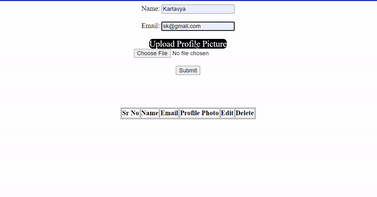

# JavaScript-Tasks
A code repo for JavaScript tasks to learning


# Task - One


# Task - Two


# Task - Three


# Task - Four


# Task - Five

```javascript
                  *
                * * *
              * * * * *
            * * * * * * *
```

# Task - Six



# Task - Seven


# Task - Eight


# Task - Nine


